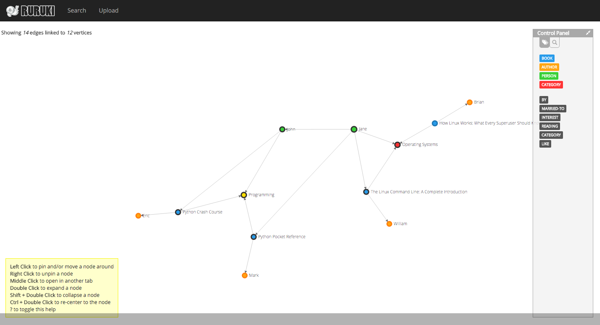

++++++++
Tutorial
++++++++

Before we start the tutorial, let first address the single most important
thing - If you are reading this, *You are awesome*

Let's begin
===========

.. note:: Each step in the tutorial will continue and add from the last step.

Installing ruruki
~~~~~~~~~~~~~~~~~~
Lets first create an environment where we can install `ruruki` and use it.

* We will do this using a python virtual environment.

.. code-block:: bash

    $ virtualenv-2.7 ruruki-ve
    New python executable in ruruki-ve/bin/python2.7
    Also creating executable in ruruki-ve/bin/python
    Installing setuptools, pip...done.

* Install the graph database library into the newly created virtual environment.
  
  .. code-block:: bash

    $ ruruki-ve/bin/pip install ruruki
    Collecting ruruki
      Downloading http://internal-index.com/prod/+f/2e6/c4263fb2b546a/ruruki.tar.gz
    Installing collected packages: ruruki
      Running setup.py install for ruruki
    Successfully installed ruruki

Creating a database
~~~~~~~~~~~~~~~~~~~

.. note::

    Please keep in mind that the library is only installed into the virtual
    environment you created above, not your system-wide Python installation,
    so to use it you'll need to run the virtual environment's
    Python interpreter:

    .. code-block:: bash

        $ ruruki-ve/bin/python

* Let's start with first creating the graph.

.. code-block:: python

    >>> from ruruki.graphs import Graph
    >>> graph = Graph()

* In order to use the :meth:`.IGraph.get_or_create_vertex` and
  :meth:`.IGraph.get_or_create_edge` effectively we should create some
  constraints to ensure uniqueness.

.. code-block:: python

    # Ensure that vertices/nodes person, book, author, and category have a
    # unique name property.
    >>> graph.add_vertex_constraint("person", "name")
    >>> graph.add_vertex_constraint("book", "name")
    >>> graph.add_vertex_constraint("author", "name")
    >>> graph.add_vertex_constraint("category", "name")

Adding in some data
~~~~~~~~~~~~~~~~~~~

Now that we have a empty graph database, lets start adding in some data.

* Create some nodes. Because we added uniqueness constraints above, we can use
  the :meth:`.IGrapph.get_or_create_vertex` method to ensure we don't create
  duplicate vertices with the same details.

.. code-block:: python

    # add the categories
    >>> programming = graph.get_or_create_vertex("category", name="Programming")
    >>> operating_systems = graph.get_or_create_vertex("category", name="Operating Systems")

    # add some books
    >>> python_crash_course = graph.get_or_create_vertex("book", title="Python Crash Course")
    >>> python_pocket_ref = graph.get_or_create_vertex("book", title="Python Pocket Reference")
    >>> how_linux_works = graph.get_or_create_vertex("book", title="How Linux Works: What Every Superuser Should Know", edition="second")
    >>> linux_command_line = graph.get_or_create_vertex("book", title="The Linux Command Line: A Complete Introduction", edition="first")

    # add a couple authors of the books above
    >>> eric_matthes = graph.get_or_create_vertex("author", fullname="Eric Matthes", name="Eric", surname="Matthes")
    >>> mark_lutz = graph.get_or_create_vertex("author", fullname="Mark Lutz", name="Mark", surname="Lutz")
    >>> brian_ward = graph.get_or_create_vertex("author", fullname="Brian Ward", name="Brian", surname="Ward")
    >>> william = graph.get_or_create_vertex("author", fullname="William E. Shotts Jr.", name="William", surname="Shotts")

    # add some random people
    >>> john = graph.get_or_create_vertex("person", name="John", surname="Doe")
    >>> jane = graph.get_or_create_vertex("person", name="Jane", surname="Doe")

* Create a relationships between vertices created above. Again notice the use of :meth:`.IGraph.get_or_create_edge` to ensure uniqueness between
  the head and tails for the particular edge labels being created.

.. code-block:: python

    # link the books to a category
    >>> graph.get_or_create_edge(python_crash_course, "CATEGORY", programming)
    >>> graph.get_or_create_edge(python_pocket_ref, "CATEGORY", programming)
    >>> graph.get_or_create_edge(linux_command_line, "CATEGORY", operating_systems)
    >>> graph.get_or_create_edge(how_linux_works, "CATEGORY", operating_systems)

    # link the books to their authors
    >>> graph.get_or_create_edge(python_crash_course, "BY", eric_matthes)
    >>> graph.get_or_create_edge(python_pocket_ref, "BY", mark_lutz)
    >>> graph.get_or_create_edge(how_linux_works, "BY", brian_ward)
    >>> graph.get_or_create_edge(linux_command_line, "BY", william)

    # Create some arbitrary data between John and Jane Doe.
    >>> graph.get_or_create_edge(john, "READING", python_crash_course)
    >>> graph.get_or_create_edge(john, "INTEREST", programming)
    >>> graph.get_or_create_edge(jane, "LIKE", operating_systems)
    >>> graph.get_or_create_edge(jane, "MARRIED-TO", john)
    >>> graph.get_or_create_edge(jane, "READING", linux_command_line)
    >>> graph.get_or_create_edge(jane, "READING", python_pocket_ref)

Below is a visualization of the graph so far

Searching for information
~~~~~~~~~~~~~~~~~~~~~~~~~

Let's start searching and looking for data.

.. note::

    The examples below only demonstrate filtering and searching on vertices,
    but the same operations can be applied to edges too.

* Find all people.

.. code-block:: python

    >>> print graph.get_vertices("person").all()
    [<Vertex> ident: 10, label: person, properties: {'surname': 'Doe', 'name': 'John'},
     <Vertex> ident: 11, label: person, properties: {'surname': 'Doe', 'name': 'Jane'}]

* Finding all help and reference books.

.. code-block:: python

    >>> result = graph.get_vertices("book", name__contains="Reference") | graph.get_vertices("book", title__contains="Crash Course")
    >>>> print result.all()
    [<Vertex> ident: 4, label: book, properties: {'name': 'Python Pocket Reference', 'title': 'Python Pocket Reference'},
     <Vertex> ident: 2, label: book, properties: {'name': 'Python Crash Course', 'title': 'Python Crash Course'}]

* Finding all python books excluding crash course books.

.. code-block:: python

    >>> result = graph.get_vertices("book", name__contains="Python") - graph.get_vertices("book", title__contains="Crash Course")
    >>>> print result.all()
    [<Vertex> ident: 4, label: book, properties: {'name': 'Python Pocket Reference', 'title': 'Python Pocket Reference'}]

* If you already know that identity number

.. code-block:: python

    >>> print repr(graph.get_vertex(0))
    <Vertex> ident: 0, label: category, properties: {'name': 'Programming'}

Dumping and loading data
~~~~~~~~~~~~~~~~~~~~~~~~

Ruruki is an in-memory database, so all the data goes away when your program
exits. However, Ruruki provides :meth:`~.IGraph.dump`
and :meth:`~.IGraph.load` methods that
will let you record a graph to disk and load it again later.

* Dumping your graph so that you can use it later.

.. code-block:: python

    >>> graph.dump(open("/tmp/graph.dump", "w"))

* Loading a dump file.

.. code-block:: python

    >>> graph.load(open("/tmp/graph.dump"))

Tutorial demo script
~~~~~~~~~~~~~~~~~~~~

The above demo script can be found under ruruki/test_utils/tutorial_books_demo.py
